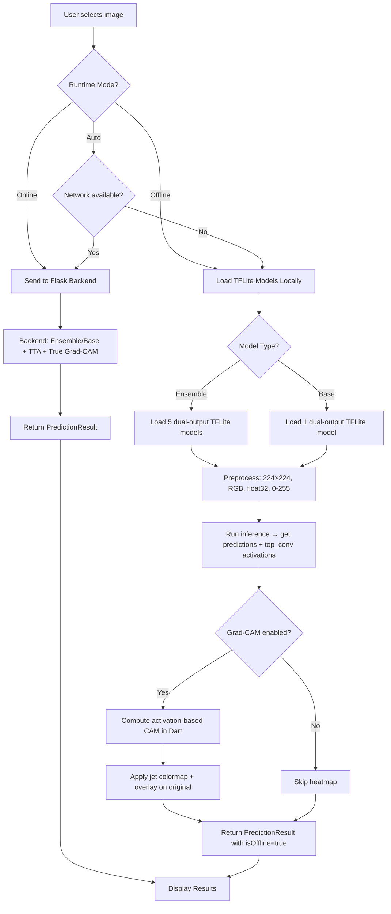

# Offline Model Integration — Ensemble + Base + Grad-CAM

Make the Coral Health AI Flutter app run **both model types** (Ensemble & Base) with **Grad-CAM heatmaps** entirely **on-device** — no internet required.

## Current Architecture

| Component | Detail |
|---|---|
| **Ensemble Model** | EfficientNetB0, 5-seed SWA (seeds 42–46), ~16 MB each |
| **Base Model** | EfficientNetB0, frozen backbone, single seed 42, ~16 MB |
| **Input** | 224×224 RGB, float32, pixel range 0–255 |
| **Output** | 3 classes — `Healthy`, `Bleached`, `Dead` |
| **Calibration** | Temperature scaling `T = 0.4414` (ensemble only) |
| **Grad-CAM** | Server-side via Keras `GradientTape` on `top_conv` layer |

---

## The Grad-CAM Offline Challenge & Solution

> [!IMPORTANT]
> **TFLite cannot compute gradients.** Keras `GradientTape` is not available on mobile. So we cannot run true Grad-CAM on-device.

### Solution: Dual-Output TFLite + Score-CAM Approximation

Instead of gradients, we export a **dual-output TFLite model** that returns:
1. **Output 0**: Class probabilities `[1, 3]` (the normal prediction)
2. **Output 1**: Last conv layer activations `[1, 7, 7, 1280]` (the `top_conv` feature maps)

Then in Dart, we compute a **Score-CAM style heatmap**:
- For each feature map channel, compute its spatial average (weight)
- Use the predicted class probability as the weighting signal
- Weighted-sum the activation maps → ReLU → normalize → resize to 224×224

This gives us a **visually similar heatmap** to Grad-CAM without needing gradients. The `top_conv` layer in EfficientNetB0 outputs a `7×7×1280` tensor, which is small enough to process efficiently in Dart.

```
┌─────────────────────────────────────────────────┐
│  Standard TFLite          Dual-Output TFLite    │
│  ┌─────────┐              ┌─────────┐           │
│  │  Input   │              │  Input   │          │
│  │224×224×3 │              │224×224×3 │          │
│  └────┬─────┘              └────┬─────┘         │
│       │                         │                │
│  ┌────▼─────┐              ┌────▼─────┐         │
│  │EfficientB0│              │EfficientB0│        │
│  └────┬─────┘              └──┬───┬───┘         │
│       │                       │   │              │
│  ┌────▼─────┐           ┌────▼┐ ┌▼────────┐    │
│  │  Dense   │           │Dense│ │top_conv  │    │
│  │ [1, 3]   │           │[1,3]│ │[1,7,7,  │    │
│  └──────────┘           └─────┘ │1280]     │    │
│                                  └──────────┘    │
│  1 output                2 outputs               │
└─────────────────────────────────────────────────┘
```

---

## Proposed Changes

### Phase 1: Model Conversion Script (Python)

#### [NEW] `09_MobileApps/scripts/convert_to_tflite.py`

Converts all models to dual-output TFLite with float16 quantization.

**Ensemble models (5 files):**
```python
# For each seed (42–46):
# 1. Rebuild architecture: EfficientNetB0 → GAP → Dropout → Dense(3)
# 2. Load SWA weights from .h5
# 3. Create dual-output Keras model:
#    - Output 1: final softmax probabilities
#    - Output 2: top_conv layer activations (7×7×1280)
# 4. Convert to TFLite with float16 quantization
# 5. Save as coral_ensemble_seed{N}.tflite (~4 MB each)
```

**Base model (1 file):**
```python
# 1. Rebuild baseline architecture: EfficientNetB0(frozen) → GAP → Dense(3)
# 2. Load weights from efficientnetb0_baseline.weights.h5
# 3. Create dual-output model (same approach)
# 4. Convert to TFLite with float16 quantization
# 5. Save as coral_base.tflite (~4 MB)
```

**Expected output:**
```
assets/models/
├── coral_ensemble_seed42.tflite   (~4 MB)
├── coral_ensemble_seed43.tflite   (~4 MB)
├── coral_ensemble_seed44.tflite   (~4 MB)
├── coral_ensemble_seed45.tflite   (~4 MB)
├── coral_ensemble_seed46.tflite   (~4 MB)
├── coral_base.tflite              (~4 MB)
├── temperature.txt                (19 bytes)
└── model_metadata.json            (model info)
```

**Total app size increase: ~24 MB** (6 models × ~4 MB each)

---

### Phase 2: Flutter Offline Inference Service

#### [NEW] `lib/src/features/assessment/data/offline_prediction_service.dart`

Core offline inference engine with Grad-CAM support.

```dart
class OfflinePredictionService {
  // Loads TFLite interpreters from assets
  // Supports both ensemble (5 models) and base (1 model)
  
  Future<PredictionResult> predict({
    required SelectedCoralImage image,
    required AssessmentConfig config, // ensemble vs base, gradcam on/off
  });
}
```

**Key responsibilities:**

1. **Image Preprocessing** (matching backend exactly):
   - Decode image bytes from camera/gallery/asset
   - Resize to 224×224 using bilinear interpolation
   - Convert to RGB float32
   - Keep pixel range 0–255
   - Shape into tensor `[1, 224, 224, 3]`

2. **Model Inference:**
   - **Ensemble mode**: Load 5 seed TFLite interpreters, run each, average probabilities
   - **Base mode**: Load 1 base TFLite interpreter, run once
   - Apply temperature scaling (`T = 0.4414`) for ensemble calibration
   - Determine prediction, confidence, uncertainty flag

3. **Offline Grad-CAM** (when enabled):
   - Collect `top_conv` activations from output tensor 2 (`[1, 7, 7, 1280]`)
   - For ensemble: average activation maps across 5 models
   - Compute channel weights via Global Average Pooling
   - Weighted sum of activation maps → ReLU → normalize to [0, 1]
   - Resize heatmap from 7×7 → 224×224
   - Generate overlay: blend heatmap (jet colormap) onto original image
   - Encode both as base64 PNG for display in result page

---

#### [NEW] `lib/src/features/assessment/data/offline_cam_utils.dart`

Pure Dart utilities for CAM computation and heatmap rendering.

```dart
class OfflineCamUtils {
  /// Compute CAM heatmap from activation tensor [7, 7, 1280]
  static Float32List computeCAM(Float32List activations, List<double> classWeights);
  
  /// Apply jet colormap to grayscale heatmap
  static Uint8List applyJetColormap(Float32List heatmap, int width, int height);
  
  /// Overlay heatmap on original image with alpha blending
  static Uint8List createOverlay(Uint8List original, Uint8List heatmap, double alpha);
  
  /// Resize 7×7 heatmap to 224×224 using bilinear interpolation
  static Float32List resizeHeatmap(Float32List heatmap, int srcSize, int dstSize);
  
  /// Encode image bytes to base64 PNG string
  static String encodeToBase64Png(Uint8List imageBytes, int width, int height);
}
```

---

### Phase 3: Update Prediction Repository

#### [MODIFY] [prediction_repository.dart](file:///c:/Users/luqma/OneDrive/Desktop/CHI/BASEPROJECT/09_MobileApps/Coral%20Mobile%20-%20Codex/lib/src/features/assessment/data/prediction_repository.dart)

- Add `runOfflinePrediction(AssessmentRun run)` method
- Add `runPrediction(AssessmentRun run, ModelRuntimeMode mode)`:
  - `online` → call backend API
  - `offline` → use `OfflinePredictionService`
  - `auto` → try online first, catch network errors → fallback to offline
- Import and use `OfflinePredictionService`

---

### Phase 4: Update Data Models

#### [MODIFY] [assessment_models.dart](file:///c:/Users/luqma/OneDrive/Desktop/CHI/BASEPROJECT/09_MobileApps/Coral%20Mobile%20-%20Codex/lib/src/features/assessment/models/assessment_models.dart)

- Add `ModelRuntimeMode` enum: `online`, `offline`, `auto`
- Add `isOffline` field to `PredictionResult`
- Add `runtimeMode` field to `AssessmentConfig`
- The existing `ModelType.ensemble` and `ModelType.base` remain unchanged — both work offline now

---

### Phase 5: Update UI Pages

#### [MODIFY] [configure_page.dart](file:///c:/Users/luqma/OneDrive/Desktop/CHI/BASEPROJECT/09_MobileApps/Coral%20Mobile%20-%20Codex/lib/src/features/assessment/pages/configure_page.dart)

- Add runtime mode selector (Online / Offline / Auto) as a toggle card
- Keep model type selector (Ensemble / Base) — both work in all modes
- Keep Grad-CAM toggle — works in all modes now (offline uses approximate CAM)
- Show info chip: "Offline CAM uses activation-based approximation"

#### [MODIFY] [analyze_page.dart](file:///c:/Users/luqma/OneDrive/Desktop/CHI/BASEPROJECT/09_MobileApps/Coral%20Mobile%20-%20Codex/lib/src/features/assessment/pages/analyze_page.dart)

- Update `_runPrediction()` to call `repository.runPrediction(run, mode)` instead of `runOnlinePrediction()`
- Show "On-Device" or "Cloud" badge during analysis animation
- Update pipeline step labels for offline: "Loading TFLite Model" → "Running Local Inference" → "Computing Attention Map"

#### [MODIFY] [result_page.dart](file:///c:/Users/luqma/OneDrive/Desktop/CHI/BASEPROJECT/09_MobileApps/Coral%20Mobile%20-%20Codex/lib/src/features/assessment/pages/result_page.dart)

- Show "On-Device Prediction" badge when `isOffline == true`
- Display Grad-CAM heatmap/overlay same as online (both produce base64 images)
- Show subtle label: "Activation-Based CAM" for offline vs "Grad-CAM" for online
- Individual model results: show all 5 seed results for ensemble, or single result for base

---

### Phase 6: Update pubspec.yaml & Assets

#### [MODIFY] [pubspec.yaml](file:///c:/Users/luqma/OneDrive/Desktop/CHI/BASEPROJECT/09_MobileApps/Coral%20Mobile%20-%20Codex/pubspec.yaml)

```yaml
dependencies:
  tflite_flutter: ^0.11.0
  image: ^4.0.0  # For image manipulation in Dart (resize, colormap, overlay)

flutter:
  assets:
    - assets/models/coral_ensemble_seed42.tflite
    - assets/models/coral_ensemble_seed43.tflite
    - assets/models/coral_ensemble_seed44.tflite
    - assets/models/coral_ensemble_seed45.tflite
    - assets/models/coral_ensemble_seed46.tflite
    - assets/models/coral_base.tflite
    - assets/models/temperature.txt
    - assets/models/model_metadata.json
```

---

## Architecture Diagram



---

## Implementation Order

| Step | Task | Est. Time |
|---|---|---|
| 1 | Write `convert_to_tflite.py` — dual-output conversion for ensemble + base | 1 hour |
| 2 | Run conversion, validate TFLite outputs match Keras within tolerance | 30 min |
| 3 | Copy `.tflite` files to Flutter `assets/models/` | 10 min |
| 4 | Add `tflite_flutter` and `image` packages to `pubspec.yaml` | 10 min |
| 5 | Build `offline_cam_utils.dart` — CAM computation + colormap + overlay | 1.5 hours |
| 6 | Build `offline_prediction_service.dart` — full inference pipeline | 1.5 hours |
| 7 | Update `prediction_repository.dart` — hybrid online/offline routing | 30 min |
| 8 | Update `assessment_models.dart` — add runtime mode, offline fields | 15 min |
| 9 | Update `configure_page.dart` — runtime mode toggle | 30 min |
| 10 | Update `analyze_page.dart` — offline-aware analysis flow | 30 min |
| 11 | Update `result_page.dart` — offline badge, CAM label | 30 min |
| 12 | End-to-end testing on emulator | 1 hour |

**Total estimated: ~8 hours**

---

## Verification Plan

### Automated Tests

```bash
# 1. Convert models
python 09_MobileApps/scripts/convert_to_tflite.py

# 2. Validate TFLite vs Keras prediction parity (3 sample images, 1 per class)
python 09_MobileApps/scripts/validate_tflite.py
# Expected: predictions match within 1% tolerance

# 3. Flutter unit tests
flutter test
```

### Manual Verification

1. **Offline ensemble**: Run app on emulator with no backend → select ensemble → upload image → verify prediction + heatmap displays
2. **Offline base**: Same flow with base model selected
3. **Online mode**: Start backend → select online mode → verify full Grad-CAM works as before
4. **Auto fallback**: Start in auto mode with backend → kill backend mid-use → verify graceful fallback to offline
5. **CAM quality**: Compare offline activation-CAM overlay vs online Grad-CAM overlay for the same images — should highlight similar regions
6. **App size**: Verify APK size increase is ~24 MB (acceptable for field use)

### Parity Checks

| Check | Expected |
|---|---|
| Ensemble prediction (offline vs online) | Same class, confidence within ±2% |
| Base prediction (offline vs online) | Same class, confidence within ±1% |
| CAM heatmap (offline vs online) | Similar highlighted regions (not pixel-identical) |
| Temperature scaling applied | Ensemble calibrated probabilities match |
