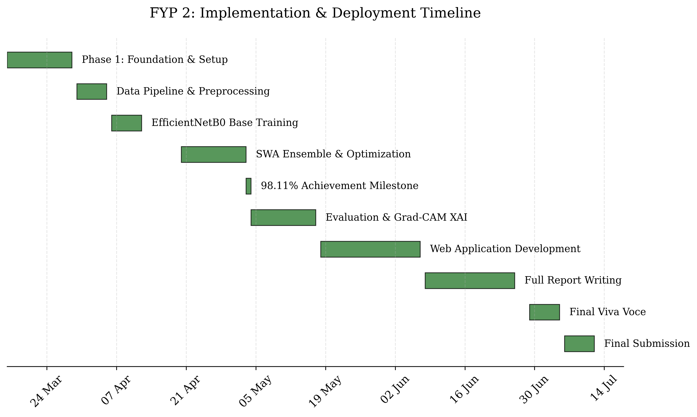

# FYP2 Gantt Chart — Coral Reef Health Assessment
## via Convolutional Neural Network-based Image Analysis

**Supervisor:** Assoc. Prof. Ts. Dr. Yasmin Yacob  
**Duration:** Week 1 (16 Mar 2026) → Week 18 (19 Jul 2026)

---

## FYP2 Development Timeline

```mermaid
gantt
    title FYP2 Project Timeline — Coral Reef Health CNN
    dateFormat  YYYY-MM-DD
    axisFormat  %d %b

    section Phase 1: Foundation
    FYP2 Briefing & Setup               :done,    p1_1, 2026-03-16, 7d
    Dataset Audit & Split Prep           :done,    p1_2, 2026-03-23, 7d

    section Phase 2: Model Development
    Data Augmentation & Preprocessing    :done,    p2_1, 2026-03-30, 7d
    EfficientNetB0 Baseline Training     :done,    p2_2, 2026-04-06, 7d
    SWA Multi-Seed Training (5 seeds)    :done,    p2_3, 2026-04-20, 7d
    TTA & Temperature Calibration        :done,    p2_4, 2026-04-27, 7d
    98.11% Accuracy Achieved             :milestone, m_acc, 2026-05-03, 0d

    section Phase 3: Evaluation & XAI
    Model Evaluation & Metrics           :done,    p3_1, 2026-05-04, 7d
    Progress Report 1 Submission         :milestone, m_pr1, 2026-05-10, 0d
    Grad-CAM XAI Implementation          :done,    p3_2, 2026-05-11, 7d

    section Phase 4: Web Application
    Flask Backend Development            :done,    p4_1, 2026-05-18, 7d
    Frontend UI/UX (design8.html)        :done,    p4_2, 2026-05-25, 7d
    System Integration & Testing         :done,    p4_3, 2026-06-01, 7d

    section Phase 5: Reports & Viva
    Progress Report 2 Submission         :milestone, m_pr2, 2026-06-08, 0d
    Talk 4: Presentation Skills          :done,    p5_0, 2026-06-08, 7d
    Full Report Writing                  :active,  p5_1, 2026-06-15, 14d
    Full Report Deadline (26 Jun)        :milestone, m_fr, 2026-06-26, 0d
    Viva Presentation                    :crit,    p5_2, 2026-06-29, 7d
    Final Report & TOC Submission        :         p5_3, 2026-07-06, 7d
    Final Deadline (12 Jul)              :milestone, m_final, 2026-07-12, 0d

    section Talks & Events
    Talk 1: Intro & Plagiarism           :done,    t1, 2026-04-06, 7d
    Talk 2: Result Analysis              :done,    t2, 2026-04-20, 7d
    Talk 3: ChatGPT & AI Tools          :done,    t3, 2026-04-27, 7d
```

---

## Key Milestones

| Date | Milestone |
|------|-----------|
| 16 Mar 2026 | FYP2 Briefing |
| 03 May 2026 | **98.11% Ensemble Accuracy Achieved** |
| 10 May 2026 | Progress Report 1 Submission |
| 08 Jun 2026 | Progress Report 2 Submission |
| 26 Jun 2026 | Full Report Submission Deadline |
| 29 Jun – 05 Jul 2026 | Viva Voce Presentation |
| 12 Jul 2026 | Final Report & TOC Submission |

---

## Phase Breakdown

### Phase 1 — Foundation & Review (Week 1–2)
- FYP2 briefing attendance
- Project re-orientation & FYP1 feedback review
- Environment setup (Python, TensorFlow, CUDA)
- Dataset audit & deterministic split creation

### Phase 2 — Model Development (Week 3–6)
- Data pipeline: OpenCV preprocessing (224×224, BGR→RGB)
- Hard-example oversampling (×20 for Bleached/Dead)
- EfficientNetB0 transfer learning baseline
- **Stochastic Weight Averaging (SWA)** — 5-seed ensemble (42–46)
- **Multi-Scale Test-Time Augmentation (TTA)** — 224+256, flip
- **Temperature Scaling** (T=0.441)
- **Final Achievement: 98.11% ensemble accuracy**

### Phase 3 — Evaluation & Explainability (Week 7–8)
- Confusion matrix & classification report
- Per-class metrics: Healthy (F1=0.99), Bleached (F1=0.98), Dead (F1=0.97)
- **Grad-CAM** explainability with JET colormap
- Per-image audit verification

### Phase 4 — Web Application (Week 9–11)
- Flask backend with inference API
- Professional landing page (design8.html)
- Interactive "Try Model" with drag-and-drop upload
- Grad-CAM overlay visualization in browser
- `run_coral_ai.bat` launcher

### Phase 5 — Reports & Viva (Week 12–18)
- Progress Report 2 submission
- Full report writing (all chapters)
- Viva presentation (slides + live demo)
- Final report & TOC submission

---

---

## FYP 1: Foundation & Research Visual


---

## FYP 2: Implementation & Deployment Visual


*Latest Version: 24 June 2026*  
*Generated via custom Matplotlib script*
